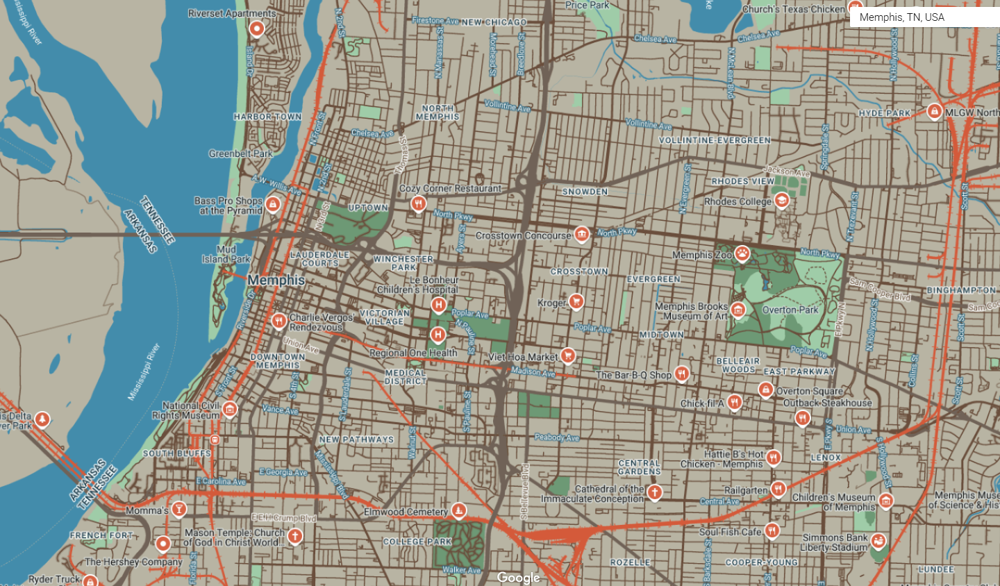
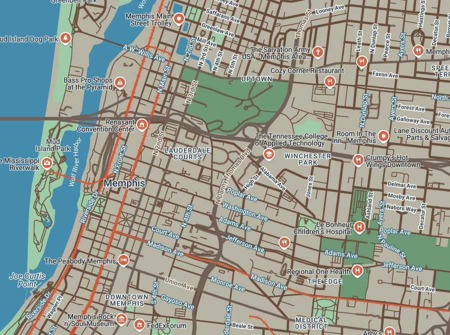
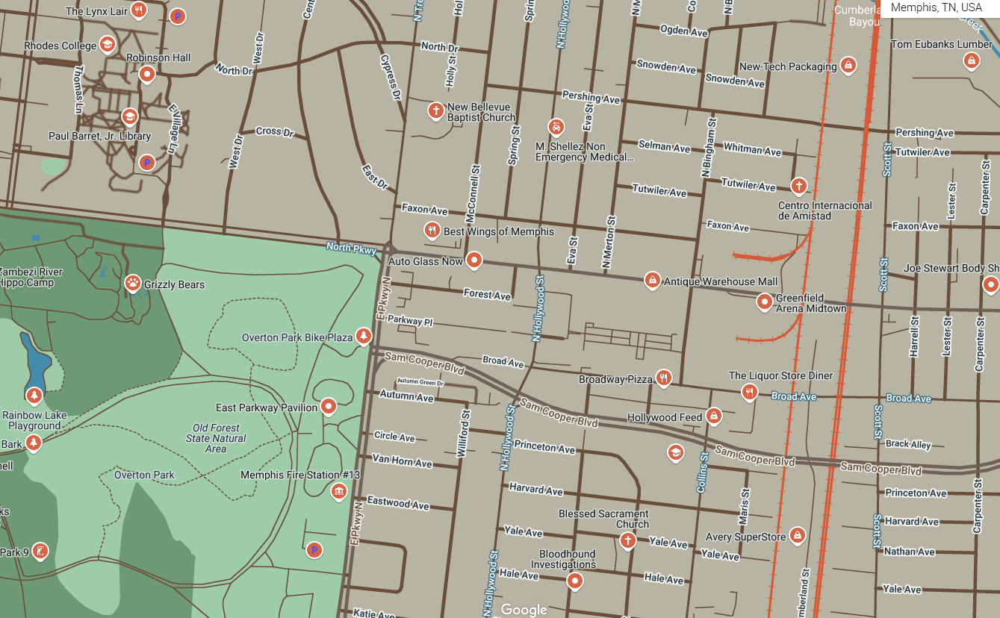

#### [**Home**](https://morgansh9212.github.io/morgan_shaw_portfolio/) | [**GIS Work**](portfoliopage.md) | [**Data Viz**](/DataViz/portfoliopage.md)
---
# CommuteOptions Memphis Basemap Project

## Project Summary
CommuteOptions is a non-profit located in Memphis, TN that advocates for improving safe, accessible transportation options for people of all ages and abilities. They focus on providing education, promotion, and resources for people trying to get to work or school using options other than a personal vehicle. They aim to provide a site with locations of transportation resources and want a basemap that fits their organization’s color scheme, the theme of green transportation, and colors that are friendly for children and adults. 

## Color Palette Design

Using a combination of Canva's pallette tool and ChatGPT I generated a color palette of six colors from a screenshot of [this page](https://www.commuteoptionsmemphis.com/bicycling):

| Color Name   | Hex Code|
|--------------|----------|
| Kobicha      | '#6b4f3b'|
|Nomad         | '#b8b4a2'|
|Boston Blue   | '#3b8bac'|
| Neptune      | '#87b8bd'|
|Verdigris     | '#59a96a'|
|Memphis Sunset| '#d95d39'|

## Basemap design

### Using these colors and some variations on these colors for contrast where necessary, I created the following basemap shown in three extents:

#### Large Zoom Extent

#### Medium Zoom Extent  

#### Local Zoom Extent

JSON code for this basemap is available [here.](commuteoptionsbm.json)

### Palette Table

| Feature Type                | Element Type         | Hex Code   | Color Name       |
|-----------------------------|----------------------|------------|------------------|
|         All                 | Geometry             | `#b8b4a2`  | Nomad            |
|         All                 | Labels/Icon          | `#d95d39`  | Memphis Sunset   |
|         All                 | Labels/Text/Fill     | `#1b3d4b`  | Dark Slate Blue  |
|        Land Parcel          | Geometry/Fill        | `#a7bbbe`  | Pewter Blue      |
| Land Parcel                 | Labels/Text/Fill     | `#b8b4a2`  | Nomad            |
| POI                         | Geometry             | `#59a96a`  | Verdigris        |
| POI                         | Labels/Text/Fill     | `#121212`  | Very Dark Gray   |
| POI                         | Labels/Text/Stroke   | `#87b8bd`  | Neptune          |
| POI/Park                    | Geometry             | `#59a96a`  | Verdigris        |
| POI/Park                    | Labels/Text/Fill     | `#132e3a`  | Dark Teal        |
| Road                        | Geometry             | `#6b4f3b`  | Kobicha          |
| Road/Arterial               | Labels/Text/Fill     | `#ffffff`  | White            |
| Road/Arterial               | Labels/Text/Stroke   | `#2e6e8a`  | Steel Blue       |
| Road/Highway                | Geometry             | `#6b4f3b`  | Kobicha          |
| Road/Highway                | Labels/Text/Fill     | `#6b4f3b`  | Kobicha          |
| Road/Highway                | Labels/Text/Stroke   | `#ffffff`  | White            |
| Road/Local                  | Geometry             | `#6b4f3b`  | Kobicha          |
| Road/Local                  | Labels/Text/Fill     | `#173340`  | Gunmetal         |
| Road/Local                  | Labels/Text/Stroke   | `#ffffff`  | White            |
| Transit/Line                | Geometry             | `#d95d39`  | Memphis Sunset   |
| Transit/Station             | Geometry             | `#eeeeee`  | Very Light Gray  |
| Water                       | Geometry             | `#3b8bac`  | Boston Blue      |
| Water                       | Labels/Text/Fill     | `#ffffff`  | White            |

## Design Decisions

This map is to be used by the general public looking for transportation resources. As it is focused on people not necessarily using cars to get around, I made sure that local lower traffic volume and speed roads were easily distinguishable and wide enough for the viewer, especially if they are using this map on a mobile device. Highways are less prominent. 
Things like transit lines, parks, and points of interest are a brighter orange (appropriately named Memphis Sunset).
I made sure the design was most easily read at a hyperlocal level, as people walking or biking are generally traveling shorter distances and more interested in the resources within a mile or so of their location.

  
Appendices for Project Assignment Requirements

  ### Appendix:
[Link to Mock RFP Response](https://docs.google.com/document/d/1hx2VI7bSHojzuVIY6cRUnDqo3duGA9Mb/edit?usp=sharing&ouid=110243025762631979777&rtpof=true&sd=true)
[GIS Process Log](https://docs.google.com/document/d/1naXKGcAeQiDBsA2vg8yW3OS3d84jtXy3M-aqIxYOv34/edit?usp=sharing)

